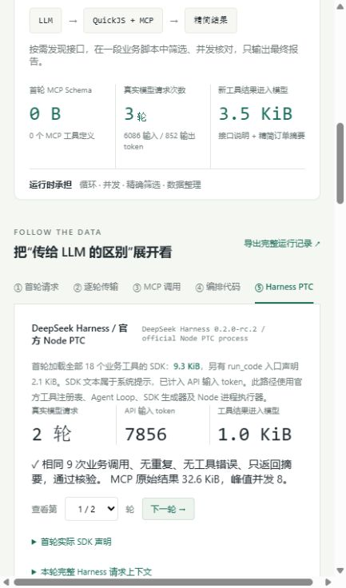

# Tool Calling、Pi Codemode 与 Harness PTC：一次真实 MCP 编排实验

同一个订单跟进任务，分别用逐步 Tool Calling、并行 Tool Calling、Pi Codemode 和 DeepSeek Harness PTC 执行，会有什么区别？

在这次实验中，PTC 用 **2 轮模型请求**完成任务，Pi Codemode 用 **3 轮**；但 Codemode 的累计输入是 **6,086 token**，比 PTC 的 **7,856 token**少约 **22.5%**。两条代码路径都执行了相同的 9 次业务工具调用，只把整理后的结果交给模型。

这组数据说明了一种具体取舍：提前提供完整 SDK，可以省去本次实验中的接口发现往返；按需发现接口，可以减少接口说明进入模型的输入量。**“本次 PTC 更快、Codemode 输入更省”是实测结果，不能直接写成两个框架在所有任务中的性能排名。**

本文附带可运行的 [Demo](demo/README.md)、[实验指标](results/summary.json)、[公开执行记录](results/online-2026-10-02.json)和[证据核验脚本](scripts/verify-evidence.mjs)。实验时间：2026-10-02，使用 Pi SDK 1.0.0、Harness 0.2.0-rc.2 和 DeepSeek 官方 `deepseek-flash`。

## 1. 先明确比较的是什么

MCP 负责提供工具协议；Tool Calling 负责让模型选择工具与参数；Codemode 和 PTC 则把多步工具编排交给模型生成的程序。这几件事发生在不同层面。

本实验中，四条路径访问的是同一个只读 stdio MCP 服务。差别在于：工具说明怎样进入模型，谁控制下一次业务调用，以及哪些中间结果回到模型上下文。

| 路径 | 首轮接口说明 | 调度与数据处理 | 模型收到的工具结果 |
| --- | --- | --- | --- |
| 逐步 Tool Calling | 全部 MCP 工具声明 | 模型逐轮选一个工具 | 原始订单、支付和物流结果 |
| 并行 Tool Calling | 全部 MCP 工具声明 | 模型一次请求多个独立核对，宿主并行执行 | 同样的原始结果 |
| Pi Codemode | codemode 入口、MCP 服务器摘要；随后发现接口 | 模型生成 JavaScript，QuickJS 执行 | 接口发现说明、脚本输出 |
| Harness PTC | run_code 入口、全部可见业务工具的 SDK 文本 | 模型生成程序，官方 Node PTC 执行器运行 | 外层程序返回的报告 |

**并行调用本身不是 Codemode 或 PTC 的独占能力。** 所以本实验保留了并行 Tool Calling 基线，避免把“传统调用逐步执行、代码路径并行执行”造成的差异全部归功于代码编排。

这里也不是用两个历史 Pi 二进制做升级跑分：三条 Pi 路径均使用 SDK 1.0.0，用 `direct` 和 `codemode` exposure 展示两种执行方式。Harness 则使用官方核心组件组合，比较同一任务下的 PTC 路径。

## 2. 用一个能核验的业务场景

用户任务：

> 筛出支付超过 72 小时、仍未发货的订单，逐一核对支付和物流状态，按支付等待时间列出前三条，并给出跟进建议。

MCP 服务提供 18 个工具，其中本任务只需要：

| 工具 | 用途 | 返回字段示例 |
| --- | --- | --- |
| `list_orders` | 读取订单列表 | `orders`、`paidHoursAgo`、`paymentStatus`、`shipmentStatus` |
| `get_payment` | 核对一个订单的支付状态 | `status`、`paidHoursAgo`、`transactionId`、`auditTrail` |
| `get_shipment` | 核对一个订单的物流状态 | `status`、`warehouse`、`trackingNo`、`scanHistory` |

其余 15 个是其他业务功能的只读接口，用于观察无关工具声明的上下文开销。支付和物流结果包含较长的合成审计记录，用于观察“原始结果回到模型”和“在运行时过滤后再返回”的差异。

所有订单、客户姓名、金额、支付、物流及审计记录均为**合成数据**，没有连接真实电商系统。每次业务工具调用模拟 25 ms I/O。

四条路径共享相同规则：列表只读一次，先同时满足 `paidHoursAgo > 72`、`paymentStatus === "paid"`、`shipmentStatus === "pending"`，再对每个候选各核对一次支付和物流。必须核对全部候选，包括最终前三名之外的候选；不得重复查询或调用无关工具。

12 条订单筛出 4 条候选，因此每条有效路径必须执行：

```text
1 次读取列表 + 4 ×（1 次支付核对 + 1 次物流核对）= 9 次业务 MCP 调用
```

结果均为 4 条待跟进，前三条是 `ORD-011`（173 小时）、`ORD-009`（147 小时）、`ORD-007`（121 小时）。建议文字允许不同，订单数量、排序、金额和仓库等事实必须一致。

## 3. 四条路径如何走完任务

| 路径 | 第 1 轮 | 第 2 轮 | 第 3 轮及以后 |
| --- | --- | --- | --- |
| 逐步调用 | 请求列表 | 请求一个状态 | 每轮请求一个状态，第 10 轮给最终答案 |
| 并行调用 | 请求列表 | 同一响应发出 8 个核对，宿主并行执行 | 第 3 轮给最终答案 |
| Pi Codemode | 生成发现脚本，获取接口说明 | 生成一段完整业务脚本 | 第 3 轮基于摘要给最终答案 |
| Harness PTC | 读取已提供的 SDK，生成完整业务程序 | 基于程序报告给最终答案 | 本次没有后续轮次 |

这些流程通过路径提示明确约束，是受控机制实验。特别是 Codemode 被要求先发现、再编排，PTC 被要求使用已提供的 SDK 写一个完整程序。因此 **3 轮与 2 轮不是框架强制下限**，也不能据此证明 Codemode 必然多一轮。

### Pi Codemode：发现接口，再执行编排

本次第一段代码由在线模型实际生成，搜索返回 5 个接口说明，其中包含 3 个需要的业务接口：

```javascript
const hits = await searchTools("orders payment shipment status list", { limit: 5 });
for (const hit of hits) {
  text(await describeTool(hit.name));
}
```

第二段代码取列表、筛选、并发核对、排序，只用 `text()` 输出报告。MCP 调用返回 `CallToolResult`，代码先检查 `isError`，再取 `structuredContent` 或解析文本 JSON。

在所用配置下，MCP 工具不预先声明给模型，模型通过 `searchTools()`、`describeTool()` 获取所需信息。QuickJS 不提供 Node API、文件系统或直接网络访问；外部能力由工具绑定提供。异步调用必须正确 `await`，因为脚本结束时未完成的调用会被取消。这些机制见 [Pi Codemode 官方文档](https://pi.dev/docs/latest/codemode)及 [MCP exposure 文档](https://pi.dev/docs/latest/mcp)。

### Harness PTC：SDK 已在上下文中，直接写程序

本次使用官方 `ToolRuntime` 的 `mode: ptc`。模型可调用的入口是 `run_code`；全部 18 个可见业务工具的 SDK 由官方生成器放入系统提示。程序内部仍然能通过 `tools.<name>()` 调用业务接口，接口声明并没有消失。见 [Harness 工具运行时说明](https://github.com/deepseek-ai/deepseek-harness/blob/master/packages/core/tools/README.md)。

在线模型生成的程序直接访问返回值，例如：

```javascript
const list = await tools.mcp__orders__list_orders({});
const candidates = list.orders.filter(o =>
  o.paidHoursAgo > 72 &&
  o.paymentStatus === "paid" &&
  o.shipmentStatus === "pending"
);

const verified = await Promise.all(candidates.map(async o => {
  const [pay, ship] = await Promise.all([
    tools.mcp__orders__get_payment({ orderId: o.orderId }),
    tools.mcp__orders__get_shipment({ orderId: o.orderId })
  ]);
  return { o, pay, ship };
}));

// 随后核验实际状态、排序、取前三条；完整程序见公开执行记录。
```

这里的 MCP bridge 先解包服务返回的 wrapper，再把 canonical JSON 交给 Harness；业务数据和实际 MCP 调用与 Pi 路径一致。为兼容 Harness 的 JSON Schema 子集，`trackingNo` 的 `string/null` 类型数组等价转换成 `oneOf`。

执行器使用官方 `NodePtcRuntime`，每次启动新的 Node 进程。其 Node API 能力及约束取决于所组合的操作系统沙箱；它与 QuickJS 的能力边界不同，不能把两种执行器视为相同的安全隔离。见 [官方 Node PTC 执行器说明](https://github.com/deepseek-ai/deepseek-harness/blob/master/packages/ptc-runtime/ptc-runtime-node/README.md)。

本实验只注册合成订单接口，使用 Windows `read-only` 文件沙箱，程序期限 30 秒，输出上限 16,000 字节。运行记录报告的文件沙箱 enforcement 为 `partial`，本实验不验证完整安全隔离。采用官方 Cordis、工具注册表、SDK 生成器、AgentLoop、Session 和 PTC 执行器，未加载完整 DSH 产品的其他工具、个人配置及默认身份提示。具体组合见 [ptc.mjs](demo/ptc.mjs)。

## 4. 实验条件与数据

| 项目 | 本次设置 |
| --- | --- |
| 在线模型 | DeepSeek 官方 `deepseek-flash`，运行前通过模型列表核验 |
| 模型参数 | `thinking: disabled`、`temperature: 0`、`max_tokens: 6000` |
| Pi SDK / Harness | `1.0.0` / `0.2.0-rc.2` |
| 操作系统 / Node | Windows / `24.14.1` |
| 数据与工具 | 12 条合成订单、18 个业务工具、25 ms 模拟 I/O |
| 业务操作 | 每条路径均为相同的 9 次调用 |
| 执行顺序 | 逐步调用 → Codemode → 并行调用 → PTC，依次运行 |
| 运行次数 | 四路径完整在线实验 1 组；未统计多次均值或分位数 |
| 记录生成时间 | 2026-10-02 18:42:12，Asia/Shanghai |

本次表格全部取自同一组已完成的在线执行记录，不把不同轮次实验的最好结果拼在一起。模型真实选择工具、生成程序并输出最终答案；宿主只对 Codemode 的执行控制行设置期限与输出上限，没有替换业务代码。

| 指标 | 逐步 Tool Calling | 并行 Tool Calling | Pi Codemode | Harness PTC |
| --- | ---: | ---: | ---: | ---: |
| 真实模型请求 | 10 | 3 | 3 | 2 |
| API 输入 token，含缓存 | 67,339 | 17,066 | 6,086 | 7,856 |
| API 输出 token | 976 | 871 | 852 | 661 |
| 缓存命中输入 token | 61,056 | 10,368 | 4,864 | 4,096 |
| 实际 API 请求体累计 | 303,218 B | 75,672 B | 23,167 B | 31,050 B |
| 首轮业务 MCP JSON 工具声明 | 8,994 B | 8,994 B | 0 B | 0 B |
| 首轮调用入口声明，SDK 口径 | 8,994 B | 8,994 B | 1,329 B | 2,128 B |
| 首轮完整 PTC SDK 文本 | — | — | — | 9,538 B |
| 新工具结果进入模型，累计一次 | 33,403 B | 33,403 B | 3,622 B | 1,031 B |
| 业务 MCP 调用 | 9 | 9 | 9 | 9 |
| MCP 原始结果量 | 33,403 B | 33,403 B | 33,403 B | 33,403 B |
| 峰值 MCP 并发 | 1 | 8 | 8 | 8 |
| 模型请求累计耗时 | 8,626 ms | 4,324 ms | 3,982 ms | 3,299 ms |
| 每条路径端到端耗时 | 9,002 ms | 4,456 ms | 4,164 ms | 3,757 ms |
| 业务事实及执行核验 | 通过 | 通过 | 通过 | 通过 |

**0 B 只表示没有把业务 MCP 工具作为 JSON 调用入口预先声明，不表示工具说明或全部上下文零成本。** Codemode 的入口和后续发现说明有成本；PTC 的完整 SDK 文本也已计入系统提示、HTTP 请求体和 API 输入 token，不应另加一次。

字节指标是 UTF-8 长度，不是 token。`rawMcpResultBytes` 统计 MCP 文本内容，不重复计算结构化副本；`surfacedResultBytes` 统计模型可见工具结果内容，每条计一次，Codemode 包括发现说明和执行状态头，PTC 包括外层程序报告与运行信息。SDK 声明指标保留各自表示；跨框架的输入比较以 API `usage` 与真实 HTTP 请求体为准。

## 5. 怎么解释结果

### 相比并行调用，主要收益是减少模型读取的数据

并行 Tool Calling 和 Codemode 本次都用了 3 轮，峰值并发也都是 8；输入 token 却从 17,066 降到 6,086，减少约 **64.3%**。PTC 的输入是 7,856，较并行调用减少约 **54.0%**。

程序可以在收到完整原始结果后筛选字段、核验状态、排序和汇总。模型看到的是报告，而不是审计记录和扫描历史。这使代码编排的价值不只体现在并行，也体现在控制模型上下文。

这里的原始数据仍然经过 MCP 服务和执行器，还会进入宿主调试日志；它只是没有作为全部原始工具结果进入模型请求，不能把这一点写成“没有读取原始数据”或完整的数据保密保证。

### PTC 与 Codemode：少一轮和少输入，是两个指标

PTC 提前拿到完整 SDK，本次可以直接生成业务程序，省掉接口发现轮。它端到端用时 3,757 ms，较 Codemode 的 4,164 ms 少约 **9.8%**。

Codemode 累计输入少约 **22.5%**：

```text
1 - 6,086 / 7,856 ≈ 22.5%
```

本次完整 PTC SDK 有 9,538 字节，而且随历史上下文保留。Codemode 首轮仅提供入口和服务器摘要，随后读取部分接口说明，因此总输入更少。不过 PTC 的输出是 661 token，低于 Codemode 的 852 token。

**输入 token 更少，不能直接推出账单总额更低。** 若用输入未命中、输入缓存命中、输出三档单价估算费用，应分别计算：

```text
费用 =（未命中输入 token × 未命中单价
      + 命中输入 token × 命中单价
      + 输出 token × 输出单价）/ 1,000,000
```

本仓库不把输入量降幅标成费用降幅，也不把模型 SDK 中的占位 cost 字段当成真实账单。本文不固定未来价格，金额应按实测时适用的供应商规则计算。

## 6. 结果正确，还要执行过程正确

只检查最终前三名不够。模型可能重复查了很多次，或者把完整订单、审计记录输出后，最后仍然给出正确答案。

本实验要求：

- 最终业务事实与合成数据的确定性真值一致。
- 实际业务调用集合恰好为 1 次列表、4 次支付、4 次物流，无重复和无关调用。
- 每次业务调用完成，模型可见工具结果没有错误。
- Codemode 和 PTC 的全部业务调用属于同一段业务程序。
- 两条代码路径的模型可见工具结果不包含原始订单列表和审计标记。
- Codemode 的发现结果包含所需接口及关键字段；PTC 的首轮上下文包含对应 SDK 绑定。

规则见 [benchmark-checks.mjs](demo/benchmark-checks.mjs)。Pi 回放测试覆盖正常、无候选和较大数据量，以及重复调用、工具错误、输出原始数据和缺失发现的反例；PTC 冒烟测试覆盖正常与无候选、官方内部事件、并发与原始输出反例。

在开发阶段也出现过遗漏 `await`、重复查询和输出原始数据的无效运行。这些问题需要修正 API 说明和验收规则后再完整跑一组，不能把有问题的程序当作“Codemode 正常工作”的基线。本文只使用已经通过同一套验收的四路径实验，失败历史没有混入表格。

## 7. 复现与查看证据

### 安装及本地验证

建议使用与实测一致的 Node 24.14.1。克隆仓库后：

```powershell
git clone https://github.com/baidd1011/pi-codemode-vs-ptc.git
cd pi-codemode-vs-ptc
node scripts/verify-evidence.mjs # 核验已公开的记录，无需 API Key
cd demo
npm ci                       # 安装固定版本 Pi 依赖
node setup-ptc.mjs             # 按锁文件安装官方 Harness 组件
node verify.mjs               # Pi 固定回放与流程反例，无在线请求
node verify-ptc.mjs            # 官方 PTC 运行时冒烟，无在线请求
node server.mjs
```

打开 [本地 Demo](http://127.0.0.1:4317/)，可查看首轮工具说明、逐轮输入输出、实际程序、业务调用时间线及「⑤ Harness PTC」。首次启动自动载入随仓库附带的公开记录，重新运行会生成新的本地记录。

Windows PTC 需要能够创建受限令牌。该机在嵌套的外层受限沙箱中出现过 `CreateRestrictedToken Win32 87`；从正常终端启动后，官方只读沙箱运行通过。若隔离后端不可用，运行失败，不自动退回无限制执行。其他操作系统尚未做同等实测，不承诺完全相同结果。

### 真实在线推理

```powershell
Copy-Item .env.example .env.local
# 在本机编辑 .env.local，填写 DEEPSEEK_API_KEY；不要提交该文件。
node online.mjs --check        # 官方接口鉴权并核验精确模型 ID
node online.mjs                # 连续执行四路径，会产生 API 用量
```

每条在线路径最多 64 次模型请求、130 次业务调用；每次模型请求最多等待 90 秒，路径模型请求期限 10 分钟。输出保存到 `demo/output/online-时间戳.json` 和 `demo/output/latest-run.json`，这些本地新记录默认不提交。

### 公开附件

| 文件 | 内容 |
| --- | --- |
| [summary.json](results/summary.json) | 环境、路径指标、验收结果 |
| [metrics.csv](results/metrics.csv) | 可直接读取的四路径指标表 |
| [online-2026-10-02.json](results/online-2026-10-02.json) | 真实请求体、usage、响应、代码、MCP 调用及 Harness 事件 |
| [verify-evidence.mjs](scripts/verify-evidence.mjs) | 重算 usage 汇总、调用集合及业务真值，检查公开文件 |

公开记录只替换本机绝对路径，不修改 usage、业务数据、工具调用集合或模型生成程序；字节与耗时指标仍使用当时的采集值，因此脱敏后 JSON 的当前长度不等于原始 HTTP 请求长度。API Key、Authorization header、运行时目录和个人配置均未包含在仓库中。

<details>
<summary>展开查看 PTC 在线实测页面</summary>



</details>

## 8. 结论能到哪里

本次实验支持的结论是：并行 Tool Calling 已经能减少模型往返；两条代码路径进一步把筛选和汇总留在运行时，明显减少模型输入。PTC 在本配置中少一轮、耗时更低；Codemode 在本配置中输入 token 更少。

实验仍只有一个业务场景和一次完整四路径在线运行。缓存命中不同，执行顺序固定，提示约束不同，执行器启动成本与返回格式也不同；没有测多次分布、不同工具规模、不同模型和独立冷缓存场景。它能帮助解释数据流与开销来源，不能用来发布“PTC 普遍更快”或“Codemode 普遍更便宜”的结论。

进一步比较时，需要独立控制工具规模、结果大小、缓存、提示与运行顺序，重复采样并同时记录事实正确率、执行合规率、输入输出、费用和延迟分布。这里只把这些作为后续实验方向，不把推测当成当前结果。

## 官方资料与实现入口

- [Pi MCP 文档](https://pi.dev/docs/latest/mcp)：direct / codemode exposure 与工具声明。
- [Pi Codemode 文档](https://pi.dev/docs/latest/codemode)：QuickJS、工具发现及输出边界。
- [Harness 工具注册表与 PTC](https://github.com/deepseek-ai/deepseek-harness/blob/master/packages/core/tools/README.md)：run_code、生成 SDK 与内部工具调度。
- [Harness Node PTC 执行器](https://github.com/deepseek-ai/deepseek-harness/blob/master/packages/ptc-runtime/ptc-runtime-node/README.md)：进程运行、能力边界与执行限制。
- [DeepSeek 工具调用](https://api-docs.deepseek.com/guides/tool_calls/)与[思考模式](https://api-docs.deepseek.com/guides/thinking_mode/)：在线接口说明。
- [Pi 执行路径](demo/engine.mjs)、[PTC 执行路径](demo/ptc.mjs)、[共享业务规则](demo/prompts.mjs)、[合成数据](demo/fixtures.mjs)。

官方 `latest` 文档及 `master` 源码可能继续变化。本实验以仓库锁文件和公开运行记录中的版本为准。
