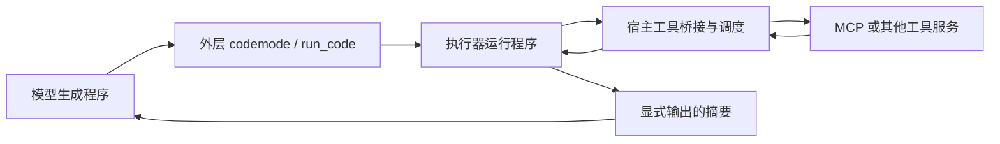

# Pi Codemode 与 DeepSeek Harness PTC：工具编排为什么要交给程序

当一个智能体需要读取多个接口、根据返回值继续查询，再把结果筛选成一份摘要时，模型究竟应该逐步指挥每次调用，还是先写一段程序，让程序完成这些步骤？

Pi Codemode 和 DeepSeek Harness PTC 都选择了后一种方式。模型负责生成编排程序，运行时负责执行程序和实际工具调用；中间结果可以留在程序变量里，最后再把需要的信息交给模型。它们有相似的数据流，但接口说明的提供方式、返回值契约和执行器不同。理解这些差异，比先给两者排一个速度名次更有用。

本文先解释这两种实现，再用同一 MCP 服务上的四条执行路径和不同规模的数据说明开销来自哪里。订单只是验证机制的例子，前半部分不依赖订单业务。最后补充跨文件 API 迁移，检查源码编辑、编译与行为验收会怎样改变比较结果。

## 模型请求、程序调用和 MCP 是三件事

普通 Tool Calling 中，宿主把工具声明放进模型请求。模型响应一个工具名称和参数，宿主执行，再把工具结果加入消息历史，让模型决定下一步。一次响应也可以包含多个独立工具调用，宿主可以并行执行；因此“并行”本身并不是代码编排的专属能力。

代码编排把一次模型选择的粒度变大了。模型仍然通过外层工具入口提交代码，但程序内部可以自己循环、分支、等待接口、并发请求和汇总。内部一次 `tools.xxx()` 调用不等于一次新的 LLM 请求。

MCP 则是底层工具服务的协议。在两种路径中，程序都可以通过宿主绑定访问同一个 MCP 服务。代码并没有代替 MCP，也不要求 MCP 服务自己能运行 JavaScript。



关键边界在于：**哪些数据要跨回模型上下文。** 程序读取了完整结果，不代表模型也必须读取完整结果。代码里保留的变量和外层工具最终输出，是不同的数据通道。

## Pi Codemode：接口可以按需发现，编排在 QuickJS 中执行

### 接口是怎样进入模型的

Pi 用工具注册表管理真实能力。启用 Codemode 后，宿主提供 `codemode` 入口，并把可调用工具映射为脚本里的 `tools.<name>()`。工具实际仍然注册在宿主中，模型看不到某个 JSON 声明，不等于这个能力不存在。

需要区分两个设置：`codemode.mode` 控制其他工具是否继续作为模型的直接入口；MCP 的 `exposure` 控制 MCP 工具如何呈现。我们的配置是 `mode: only` 加 MCP `exposure: codemode`。这使模型通过脚本调用业务能力，而业务 MCP 工具按 deferred 方式暴露，不把全量声明预载到模型上下文。

Codemode 并不把所有工具都一律隐藏。非 deferred 工具还可以按 inline budget 出现在入口描述中。因此本文讨论的“按需发现”，特指本 Demo 的 MCP 暴露配置，不能推广成任何 Codemode 配置的固定行为。

Pi 提供 `searchTools()`、`describeTool()` 和 `describeNamespace()`。宿主拥有完整的可调用工具目录；搜索和描述发生在运行时，只有脚本输出的那部分说明才会回到模型。本版本搜索使用 BM25，模型不需要先下载全部 schema 再自己筛。

下面是与业务无关的发现写法，其中查询词由当前任务决定：

```javascript
const hits = await searchTools("当前任务需要的能力", { limit: 3 });
for (const hit of hits) {
  text(await describeTool(hit.name));
}
```

搜索返回名称和简介，描述返回接口声明。模型看到参数和返回字段以后，可以在后续响应中生成实际编排程序。已知接口或已在上下文里有说明时，不一定还要重新发现；“发现一轮、业务一轮”是我们为观察机制采用的提示策略，并非框架强制的最低轮数。

### 程序怎样调用真实工具

`codemode` 的源码在 QuickJS-WASM 中执行。宿主为沙箱安装工具绑定和发现函数；内部调用经由 `ctx.executeTool()` 回到 Agent 的工具执行管线，因此仍有真实的工具事件、错误处理和父调用关联。它不是模型假装调用接口，也不是在 JavaScript 中直接拼一个未经管理的 HTTP 请求。

可以把执行过程理解成：

```text
模型提交源码
  → QuickJS 执行 async 程序
  → tools.<name>(参数) 触发宿主执行工具
  → 结果交还脚本，继续计算
  → text()/return 的输出成为外层工具结果
  → 模型读取摘要，继续回答
```

QuickJS 没有 Node API、直接文件系统、直接网络或计时器。外部能力由宿主绑定提供；绑定里允许什么仍由宿主工具和权限决定。不能从“沙箱里没有网络”推断它无法通过一个获准的工具访问远端服务。

每个工具调用和发现调用都返回 Promise，使用它们的结果前必须 `await`。脚本结束时仍在执行的调用会被取消，未等待的 Promise 会被丢弃。脚本出错也不会回滚此前已经完成的外部操作。这是正确性和副作用管理的要求，不只是代码风格。

### 原始结果为何可以不进入模型

以“读取列表，核对各条目，然后返回统计”为例，示意程序可以是：

```javascript
// 以下函数名称只是示意；实际名称及字段应从接口声明取得。
function unpack(result) {
  if (result.isError) throw new Error(JSON.stringify(result.content));
  return result.structuredContent ??
    JSON.parse(result.content.find(b => b.type === "text").text);
}
const list = unpack(await tools.mcp__service__list({}));
const selected = list.items.filter(item => item.needsCheck);
const checked = await Promise.all(selected.map(async item =>
  unpack(await tools.mcp__service__inspect({ id: item.id }))
));
text({ checkedCount: checked.length });
```

Pi 的 MCP 绑定返回 `CallToolResult` wrapper，业务字段位于 `structuredContent` 或文本内容里，需要检查错误并解包。循环中拿到的完整结果留在 QuickJS 变量中；这里模型只收到计数以及执行器的状态信息。若脚本改成 `text(list)`，模型就会收到原始列表，节省上下文的收益随之消失。

`text()`、顶层 `return` 和 `console.log()` 都可能进入输出。输出边界需要程序主动控制，框架不会自动理解哪些字段对业务无关。小型跨调用状态可以用 `store()/load()`；每次成功脚本的写入会保存到会话分支，不能把它当成存放无限原始数据的仓库。

这些机制对应 Pi 1.0.0 的 `extensions/codemode/tool.js` 和 `execute.js`。可结合 [Pi Codemode 文档](https://pi.dev/docs/latest/codemode)及 [MCP 配置文档](https://pi.dev/docs/latest/mcp)阅读；官方 latest 页面可能继续变化，本仓库以锁定版本为准。

## Harness PTC：生成 SDK，程序通过宿主调度工具

PTC 是 Programmatic Tool Calling，即程序化工具调用。这里具体比较 DeepSeek Harness 的 `ToolRuntime`、SDK 生成器和官方 `NodePtcRuntime`，而不是泛指所有以代码调用工具的方案。

### SDK 声明和模型工具入口是两种表示

Harness 的工具注册表保存名称、描述、输入 schema、输出 schema、执行函数及相关运行策略。在 `mode: ptc` 下，宿主给模型一个外层 `run_code` 工具，并把可见业务工具转换为 `tools:sdk` 提示段。对于本次 Node 执行器，这段文本是描述 `tools.<name>()` 的 TypeScript 声明及使用说明。

SDK 是帮助模型写程序的接口契约，**不是一批新的模型直接调用入口，也不是把服务实现源码打包给模型。** 实际工具仍由宿主执行。即使请求的 JSON tools 数组只有 `run_code`，系统提示里的完整 SDK 也会消耗输入 token。

本 Demo 没有额外过滤注册的业务工具，所以 3、18 或 60 个注册工具都进入 SDK。增加无关工具会增加首轮 SDK 文本。这里的“全量”指当前可见的注册工具集合，不是 Harness 在任何配置下都必须加载世界上所有工具。

### `run_code` 中的一次调用如何走到服务

模型传入 `code` 和 `description`。`code` 是 async 函数体，可以顶层 `await` 和 `return`。官方 Node 执行器处理可擦除的 TypeScript 语法、启动新的 Node 子进程，并建立宿主与执行进程之间的控制通道。

进程内的 `tools.<name>()` 是工具绑定。它把名称和 JSON 参数送回宿主；宿主查找注册工具、经过调度执行，然后把 canonical JSON 返回给进程，等待中的 Promise 才得到结果。流程是：

```text
模型调用 run_code({code, description})
  → 官方 Node 执行器启动子进程
  → 程序调用 tools.<name>(参数)
  → 控制通道转交宿主工具注册表与调度器
  → 工具执行，canonical JSON 返回程序
  → return 的值及输出形成外层工具结果
  → 模型继续生成最终答案
```

内部子调用会记录为 `tool/ptc-dispatch` 等会话事件，便于恢复调用经过；它们不都以独立的原始工具结果进入下一次模型请求。可观测的宿主日志和模型读取的上下文，依然是两个边界。

如果沿用前面的通用示例，PTC 程序是：

```javascript
// 同样只是示意；实际接口以生成的 SDK 为准。
const list = await tools.mcp__service__list({});
const selected = list.items.filter(item => item.needsCheck);
const checked = await Promise.all(selected.map(item =>
  tools.mcp__service__inspect({ id: item.id })
));
return { checkedCount: checked.length };
```

这里可以直接访问业务字段，是因为我们的 MCP bridge 已先检查并解包 MCP wrapper，再把值交给 Harness 的 canonical JSON 输出契约。**这不是 MCP 协议天然返回了不同数据。** 两边访问同一服务，适配层不同；Pi 的程序自己解包，PTC 的 bridge 解包。为兼容 Harness schema 子集，bridge 也把 `type: ["string", "null"]` 等价转换为 `oneOf`。

### 并发和沙箱分别由谁负责

`Promise.all()` 表达的是程序希望同时等待多个调用。真正同时运行多少个，还取决于宿主调度器。在本次 PTC 配置里，`maxParallelSubCalls` 为 8，超出的调用会排队，并不是写了 52 个 Promise 就有 52 路实际并发。

Node 子进程本身也不等于完整的安全沙箱。文件、进程和其他能力由所组合的运行后端及权限策略决定。我们的 Windows 后端使用 `read-only` 策略，记录的 enforcement 为 `partial`；本文不把它表述为完整隔离，也不把它与没有 Node API 的 QuickJS 混为一谈。

具体实现见 [ptc.mjs](demo/ptc.mjs)：官方 Cordis 服务组合负责 LLM 适配、工具注册、SDK、AgentLoop、会话投影和 Node PTC；独立 stdio MCP 进程负责业务接口。我们没有启动完整 Harness 产品，没有加载它的个人配置、产品默认身份或其他工具。实际比较的是官方核心执行路径，不能把测到的启动耗时当作完整桌面应用的性能。

可对照 [Harness 工具运行时](https://github.com/deepseek-ai/deepseek-harness/blob/dsh-v0.2.0-rc.2/packages/core/tools/README.md)和 [Node PTC 执行器](https://github.com/deepseek-ai/deepseek-harness/blob/dsh-v0.2.0-rc.2/packages/ptc-runtime/ptc-runtime-node/README.md)。本仓库使用 `0.2.0-rc.2`；2026-10-02 已核对，它是当时 `@deepseek-ai/dsh` 的 npm latest 和最近的 GitHub 发布版本，而非 master 最新源码。

## 两种实现的取舍在哪里

| 维度 | 本文 Pi Codemode 配置 | 本文 Harness PTC 配置 |
| --- | --- | --- |
| 模型外层入口 | `codemode` | `run_code` |
| 业务接口说明 | deferred MCP 接口按需搜索、描述 | 可见注册工具的 SDK 预先进入系统提示 |
| 执行器 | QuickJS-WASM | 官方 Node 子进程 |
| 本次 MCP 返回契约 | `CallToolResult`，脚本解包 | bridge 解包后的 canonical JSON |
| 原始结果所在位置 | 脚本变量和宿主记录 | 程序变量和宿主记录 |
| 模型收到什么 | 发现输出、显式业务输出及运行信息 | 程序返回值、输出及运行信息 |
| 实际子调用并发 | 由 Pi 工具执行管线决定 | 由 Harness 调度器及子调用上限决定 |

两者共同节省的是模型不需要读取的中间数据。相比并行 Tool Calling，它们还能把“读列表后再决定查谁”这样的依赖链放在同一段程序中，减少模型参与中间决策的次数。

两者不同的开销，一部分来自接口准备。预载 SDK 使模型可以立即写代码；按需发现使上下文只携带当前所需的接口，但搜索和描述也有成本，可能增加一次模型往返。工具少、返回值短时，这笔发现成本可能不划算；工具多而每次只用少数接口时，按需说明更有机会减少输入。

另一部分来自生成代码和执行环境。代码越长，输出 token 越多；进程启动、工具排队、错误后的修复程序也会影响延迟。少一轮模型请求并不保证整条路径更快。是否便宜还要同时看输入、缓存命中及输出：

```text
费用 =（未命中输入 × 未命中单价
      + 命中输入 × 命中单价
      + 输出 × 输出单价）/ 1,000,000
```

因此“PTC 更快、Codemode 更省”只能是某个配置的观察，不适合当成它们的定义。下面的数据用来验证开销怎样变化，而不是为两个框架给出永久排名。

## 用订单任务验证这些取舍

我们让四条路径访问同一个只读 stdio MCP 服务：逐步 Tool Calling、并行 Tool Calling、Pi Codemode 和 Harness PTC。任务是筛选支付超过72小时但仍未发货的订单，核对全部候选的支付和物流，按等待时间输出前三条。其余接口是无关的只读业务工具；订单和较长的审计、扫描字段都是合成数据。

订单数取1、12、48，工具数取3、18、60，交叉组合后每条路径重复3次。最终矩阵保留 **108 次完整任务，108 次通过核验**。完整逐次数据、失败、采集条件和耗时范围放在[证据附件](docs/matrix-evidence.md)，这里关注它们怎样支撑前面的实现解释。

### 工具规模改变的是接口说明成本

固定12条订单，只增加无关工具，业务调用仍是9次。下表输入是有效运行的中位数，已包含缓存命中：

| 工具数 | 并行 Tool Calling 输入 token | Codemode 输入 token | PTC 输入 token |
| --- | ---: | ---: | ---: |
| 3 | 10,871 | 5,655 | 4,671 |
| 18 | 17,091 | 7,582 | 7,855 |
| 60 | 34,414 | 6,093 | 16,778 |

PTC 的完整 SDK 随可见工具数增长，Codemode 的入口保持紧凑，再由发现结果补充少量接口。Codemode也不是绝对固定成本：搜索命中的数量和模型打印的声明可能不同。小工具集时，发现说明及额外往返可能比直接提供 SDK 更贵；随着无关工具增加，按需说明的收益才显现。

### 数据规模改变的是中间结果成本

固定18个工具，增加订单。模型所需的最终报告仍很短，但候选核对数增加，支付和物流的原始审计字段也随之增加：

| 订单数 | 业务调用数 | 并行 Tool Calling 输入 token | Codemode 输入 token | PTC 输入 token |
| --- | ---: | ---: | ---: | ---: |
| 1 | 1 | 6,178 | 5,944 | 7,622 |
| 12 | 9 | 17,091 | 7,582 | 7,855 |
| 48 | 53 | 53,689 | 6,066 | 7,858 |

1条订单这一行是无候选边界：只读列表，不做支付和物流核对。它能展示发现的固定开销，却不代表正常订单核对吞吐。12和48条订单的数据更能说明代码内汇总的价值：全部候选仍然被核对，模型读取的却是短报告；并行 Tool Calling 虽减少等待轮次，仍把原始结果放进模型上下文。

### 延迟要结合轮数、并发和执行配置看

为了避免只挑一个有利组合，这里列出全部九个组合。输入和耗时均为有效运行的中位数，耗时是端到端毫秒；通过数分别为Codemode/PTC：

| 订单 / 工具 | Codemode 输入 | PTC 输入 | Codemode 耗时 ms | PTC 耗时 ms | 通过 / 3（C / P） |
| --- | ---: | ---: | ---: | ---: | --- |
| 1 / 3 | 5,498 | 4,435 | 4,602 | 2,924 | 3 / 3 |
| 1 / 18 | 5,944 | 7,622 | 4,529 | 3,238 | 3 / 3 |
| 1 / 60 | 5,883 | 16,541 | 3,987 | 3,036 | 3 / 3 |
| 12 / 3 | 5,655 | 4,671 | 4,526 | 3,566 | 3 / 3 |
| 12 / 18 | 7,582 | 7,855 | 4,794 | 3,909 | 3 / 3 |
| 12 / 60 | 6,093 | 16,778 | 4,717 | 3,549 | 3 / 3 |
| 48 / 3 | 6,683 | 4,674 | 4,399 | 3,954 | 3 / 3 |
| 48 / 18 | 6,066 | 7,858 | 4,413 | 3,745 | 3 / 3 |
| 48 / 60 | 6,096 | 16,771 | 4,184 | 3,810 | 3 / 3 |

本实验提示明确要求 Codemode 先发现再写业务脚本，PTC用已提供SDK写一段程序。因此正常的代码路径通常是3轮和2轮，这个差异来自所测策略，不能当作框架强制下限。逐步调用的实际轮数也可能受模型一次提交多个请求影响，即使宿主仍逐个执行。

大数据组还有重要配置差异：Pi并行路径可以同时执行52路核对，Harness被限制在8路，超出的调用排队。网络延迟、缓存命中、生成代码长度、进程启动和执行并发都进入端到端时间。这里的观测能说明当前路径的开销，不能拆解成两个执行器的纯性能排名。

校准阶段也暴露了一个工程问题：PTC待处理调用容量16无法容纳52个请求，引起运行错误与后续重复查询。我们将容量改成64，实际并发仍为8，并完整重跑所有PTC组合；旧记录保留在附件中。运行正常以后再比较数据流，才有意义。

## 本次实验的明确结论

在所测模型、提示策略和运行配置下，结论可以明确写为：**PTC 在九个组合中都取得更低的端到端耗时中位数；Codemode 的输入量优势出现在较大的工具集合中，三个工具时则由 PTC 占优。** 两条代码路径都能把中间数据留在运行时，但接口准备方式形成了不同的开销。

**一、工具多而实际只用少数时，Codemode 的输入优势更明显。** 本任务始终只使用三个业务接口。18 个工具时，Codemode 相比 PTC 少输入 3.5%–22.8%；60 个工具时，少输入 63.7%–64.4%。因此，这组数据支持“较大的工具集合、稀疏的实际使用，有利于按需发现”的判断。这里比较的是 API 输入 token，含缓存命中，不是总账单。

**二、少量工具时，PTC 同时占据输入量和延迟优势。** 只有三个工具时，Codemode 比 PTC 多输入 21.1%–43.0%，并没有更省。接口发现本身有说明和往返成本；工具数量不足以抵消这笔成本时，直接预载 SDK 消耗的输入更少。因此，不能把“工具越多越有输入优势”改写成“Codemode 在任何工具数量下都更好”。

**三、PTC 的耗时优势在本次矩阵中一致出现。** 九个组合里，PTC 的端到端耗时中位数均低于 Codemode，降幅为 8.9%–36.5%。所以可以明确说：**在本实验配置下，PTC 稳定取得更低的耗时中位数。** 这里的“稳定”指九个组合的中位数方向一致，不表示每次单独运行都更快。预载 SDK 的路径通常用两轮模型请求，先发现再编排的路径通常用三轮；但并发上限、执行器和缓存也不同，不能把全部降幅归因于少一轮，更不能推出执行器的普遍性能排名。

**四、面对大量中间结果，两条代码路径都明显减少了模型输入。** 固定18个工具、48条订单时，同样完成53次业务调用，并行 Tool Calling 输入 53,689 token，Codemode 输入 6,066，PTC 输入 7,858，分别减少 88.7% 和 85.4%。这支持“把筛选和汇总留在程序里，可以减少模型读取中间数据”的结论，收益并非仅来自并行。

以上结论以修正配置后的108次完整任务为依据，业务事实和执行过程全部通过核验；校准失败另行保留。当前证据明确支持这些配置下的输入和耗时比较，尚未证明不同模型、不同业务、相同并发上限或独立冷缓存条件下也保持同样结果。

## 把它应用到自己的智能体

选择代码编排时，先看任务是不是有能交给程序执行的规则：字段筛选、批量核对、分页、关联、排序和汇总。把这些操作留在运行时，通常比让模型反复读完整中间结果更容易控制上下文。自然语言判断仍可由模型负责，但需要给它输出足够的事实与来源。

选择接口暴露方式时，再看工具集合。少量稳定接口可以直接提供契约；大量工具而每次只用少数时，可以考虑按需发现。不要把“首轮没有MCP JSON schema”误解成零输入成本，SDK、入口、发现说明和历史都会进入请求。

最后要验证执行过程：是否等待了全部异步调用，候选是否全部核对，有没有重复查询，输出是否真的精简，失败是否可追踪。原始数据虽然可以不交给模型，仍经过服务、宿主和运行时，不意味着它从系统里消失。

这份矩阵只是一个合成业务、一个模型和三次重复。工具描述固定、缓存未清空，提示策略受控，执行并发没有拉齐，也没有测试其他平台。它支持对输入开销来源的解释，以及这些配置下的结果；不足以证明PTC普遍更快或Codemode总账单更低。

## 运行 Demo 与检查证据

```powershell
git clone https://github.com/baidd1011/pi-codemode-vs-ptc.git
cd pi-codemode-vs-ptc
node scripts/verify-evidence.mjs
node scripts/verify-matrix.mjs
cd demo
npm ci
node setup-ptc.mjs
node verify.mjs
node verify-ptc.mjs
node server.mjs
```

打开 <http://127.0.0.1:4317/>。Demo可浏览已有单组在线记录的输入输出、程序及调用时间线；矩阵的108条记录通过CSV、JSON及gzip附件查看，界面未增加矩阵选择器。

若要真实在线运行，在本机从 `.env.example` 创建 `.env.local` 并填写Key：

```powershell
node online.mjs --check
node online.mjs   # 单个默认组合
node matrix.mjs   # 108次任务；断点续跑；会消耗在线API用量
```

矩阵结果写入本机 `demo/output/matrix-v2/`。每条在线路径最多64次模型请求，130次业务调用；单次请求最多等待90秒。Windows PTC必须能创建受限令牌；沙箱启动失败时返回错误，不自动降级。其他平台尚未同等验证。

实现入口：[Pi三路径](demo/engine.mjs)、[官方PTC组合和MCP bridge](demo/ptc.mjs)、[在线适配](demo/deepseek.mjs)、[矩阵运行器](demo/matrix.mjs)、[执行核验](demo/benchmark-checks.mjs)。版本由[Pi锁文件](demo/package-lock.json)和[Harness锁文件](demo/ptc-package-lock.json)固定。

公开证据：[矩阵说明](docs/matrix-evidence.md)、[逐次CSV](results/matrix/metrics.csv)、[聚合JSON](results/matrix/summary.json)、[矩阵manifest](results/matrix/manifest.json)。此前12单/18工具的[初始单组记录](results/online-2026-10-02.json)和[初始指标](results/summary.json)也保留，不与新矩阵拼成一组统计。API Key、Authorization header和个人配置未上传；本机路径已替换，采集时的字节值原样保留。

## 补充：先发现，再生成 SDK，交给 PTC

Codemode 的按需发现和 PTC 的程序执行可以组合。首轮只提供 Codemode 入口，模型写一段发现代码，在运行时检索接口，返回所需工具名。宿主拿这些名字查询工具注册表，取出权威的描述、输入和输出 JSON Schema，只注册选中的工具，再由 Harness 官方生成器生成 TypeScript SDK。下一轮提供 run_code 和这份小 SDK，模型编写业务代码，执行结束后再生成回答。

注册表可以理解为 `工具名 → {description, inputSchema, outputSchema, execute}`。查表、SDK 类型转换和运行时绑定都是确定性的宿主操作，**转换阶段没有额外 LLM 请求**。SDK 是接口声明和调用绑定，不是现场编译一个 npm 包。实际调用仍经 MCP bridge 访问同一个服务。

本实现由 Pi 完成发现，再由宿主把真实用户消息、模型的 Codemode 调用和发现结果接入 Harness 请求，执行阶段使用官方 Node PTC。两套框架有显式交接，也有各自的初始化成本；这不是 Harness 内部原生的一条统一 Agent loop。首轮只有 codemode，后续只有 run_code。发现阶段不执行业务，执行阶段只注册实际选出的三个工具，不通过宿主补选来纠正模型。原始请求体保存在证据里的 wirePayload。

### 本次补充结果

此前108次四路径矩阵保持原样。本次另设三路径的81个任务：3种订单数 × 3种工具数 × Codemode/PTC/融合 × 3次重复。暂停前已成功的38个任务全部保留，没有重跑；本次只续跑缺失或失败任务。最终81个任务全部通过业务事实和执行过程核验。

**重要口径：这是带校准过程的续跑结果。** 成功的融合记录包含早期发现提示和修正后的提示；不是同一最终提示下重新跑出的27次实验。融合成功记录的版本分布为hybrid-v1: 9次；hybrid-discovery-v3: 18次。早期失败是代码分别搜索三个能力、按描述关键词或首条命中选取时，重复选中了订单列表。最终协议改为一次组合检索返回三个不同接口，模型仍自行生成发现代码，没有硬编码工具名。另有本次受网络执行权限限制、无 API usage 的失败；这些记录也保留。历史失败总计57条：14次在线发现失败、43次无API用量的网络或本地失败。失败开销未加入下表成功任务的中位数，不代表包含重试的生产成本。

每格列出三次成功任务的中位数，顺序均为 **Codemode / PTC / 融合**。input token 包含缓存命中；耗时包含在线推理和本地初始化。

| 订单数 / 工具数 | API 输入 token | 端到端耗时 ms |
|---|---:|---:|
| 1 / 3 | 5498 / 4435 / 5802 | 4508 / 3057 / 4269 |
| 1 / 18 | 5925 / 7622 / 5794 | 4343 / 3103 / 4438 |
| 1 / 60 | 5904 / 16542 / 5794 | 4712 / 3334 / 3803 |
| 12 / 3 | 5662 / 4671 / 6027 | 4693 / 3620 / 4467 |
| 12 / 18 | 6093 / 7855 / 6027 | 5151 / 3992 / 4677 |
| 12 / 60 | 6093 / 16765 / 6027 | 4615 / 4199 / 4244 |
| 48 / 3 | 5675 / 4674 / 6359 | 4912 / 3851 / 5375 |
| 48 / 18 | 6096 / 7858 / 6030 | 4500 / 3646 / 5316 |
| 48 / 60 | 7584 / 16770 / 6298 | 4637 / 3714 / 5093 |

**融合保留了按需接口暴露的优势，但没有自动获得 PTC 的两轮延迟。** 本次三个业务接口的 SDK 在所有工具规模下均为3504字节；全量 PTC 的 SDK 随目录从3504增长到9538、26458字节。60个工具时，融合相比全量PTC少输入62.4%–65.0%。不过融合通常仍需“发现、编排、总结”三轮；九格中全量PTC的耗时中位数均低于融合；融合在5格低于纯Codemode。**当前结果支持用融合控制大工具目录的输入规模，不能据此把它称为最快路径，也不能据此保证比纯Codemode更省。**

发现结果会作为历史再次进入后续请求，所以只生成小 SDK 不等于零发现成本。发现代码、结果、SDK和历史都计入 API 输入。不同发现提示、缓存状态、两套框架初始化，以及 Codemode 和 PTC 不同的并发上限，仍会影响结果。这里没有做独立冷缓存、同并发上限或跨模型测试。

### 复现与证据

实现：[融合交接](demo/hybrid.mjs)、[发现阶段](demo/engine.mjs)、[选中接口注册与 SDK 生成](demo/ptc.mjs)、[续跑器](demo/hybrid-matrix.mjs)。在配置好的 demo 目录运行 `node hybrid-matrix.mjs`；运行器跳过已成功任务，失败尝试写入独立附件，不覆盖旧证据，会消耗在线 API 用量。

公开附件：[逐次指标](results/hybrid/metrics.csv)、[聚合数据](results/hybrid/summary.json)、[全部尝试及 SHA256](results/hybrid/manifest.json)。在仓库根目录运行 `node scripts/verify-hybrid.mjs`，核对事实、调用集合、SDK大小、实际请求交接、API usage和附件哈希。Hybrid 根级 initialSdkDeclarationBytes 指首次 **PTC执行阶段** SDK；首轮发现没有该 SDK。根级 accumulatedRequestBytes 来自框架内部上下文，交接后的实际网络请求以 wirePayload/wireRequestBytes 为准。未修改原始采集指标。

## 补充：编码任务会改变比较结果

订单实验把筛选规则写得很明确，主要测工具发现和程序内的数据处理。编码时，模型必须看到足够的源码和诊断信息才能决定如何修改；运行时精简输出过度，也可能损害正确性。因此，再补一个可编译、有独立验收的跨文件 API 迁移任务，观察编排机制在编码闭环里的表现。

### 从真实源码改动到独立验收

任务把 TypeScript 项目中全部 `client.request(url, options)` 迁移为 `client.send({url, ...options})`。新版客户端契约已经提供。每个模块有两个调用点，包含内联参数和复用 options 两种形式；必须保留请求路径、方法、请求体、超时、响应变换及异常传播。项目规模为3、8、16个模块，即6、16、32个调用点。

三条路径使用同一个 stdio MCP 服务，只提供五个文件/测试工具：list_files、search_text、read_file、replace_text、run_tests。每个任务从相同源码快照创建一个新的独立目录；宿主限制项目工具并发为8，同一文件编辑串行。模型不拿到固定修改脚本，不规定编码步骤或请求轮数，允许反复读、改、测。融合有一个发现调用的交接协议，后续编程轮数自主决定。每个编码执行阶段最多24轮模型请求，融合额外允许一个发现请求；本次融合实际最多10轮，没有触及预算。这个上限是实验预算，不是各路径的理论极限。

run_tests 先用固定 TypeScript 5.9.3 编译，再执行宿主保存的行为测试。每个模块有四项检查，覆盖正常请求及响应变换、health返回值、异常对象传播和超时参数。客户端、配置和测试不能通过项目工具修改。最终验收还会在模型结束后重新编译、测试，并核对保护文件；成功要求模型实际调用过测试并观察到通过结果。所有原始源码、最终源码、补丁调用、请求和验收结果都已保存。

这是一个具有实际源码编辑、类型检查和运行时行为验证的**合成小项目**，仍然没有大型真实仓库的依赖复杂度、定位歧义和非重复代码，不能代表通用编码能力排名。项目工具的可见范围是控制边界，本实验没有验证任意模型生成代码的完整安全隔离能力。

### 27个任务的结果

每个规模、每条路径重复三次，总计27个任务，24个通过；Codemode 9/9，全量 PTC 6/9，融合 9/9。表中为每组全部三次任务的中位数，**真实任务失败也计入耗时和输入量**。用量来自实际API usage，input包含缓存命中，不等同于账单。端到端耗时包含模型、工具、执行器初始化和运行器内的终检，不含项目创建、以及矩阵外层的第二次验收。

| 模块数 | 路径 | 成功 | 模型请求轮数 | 输入 token | 耗时秒 |
|---|---|---:|---:|---:|---:|
| 3 | Codemode | 3/3 | 12 | 37392 | 15.44 |
| 3 | 全量 PTC | 1/3 | 24 | 150886 | 26.56 |
| 3 | 融合 | 3/3 | 9 | 32260 | 14.32 |
| 8 | Codemode | 3/3 | 12 | 52055 | 15.96 |
| 8 | 全量 PTC | 3/3 | 8 | 31809 | 13.59 |
| 8 | 融合 | 3/3 | 6 | 24076 | 11.79 |
| 16 | Codemode | 3/3 | 16 | 109564 | 20.89 |
| 16 | 全量 PTC | 2/3 | 22 | 286101 | 37.59 |
| 16 | 融合 | 3/3 | 8 | 46860 | 14.01 |

**PTC“两轮完成”和“稳定更快”不能从订单任务推广到编码任务。** 本次编码任务的实际请求数为6–24轮；各规模耗时中位数最低的路径分别是3模块 融合，8模块 融合，16模块 融合。读源码、编辑和根据诊断修正需要新的模型决策；一段程序可以合并已知操作，但不能预先替代全部后续推理。

这次融合在三个规模下都取得最低的输入量和耗时中位数，并通过9/9任务；这是本次配置的观测结果。**不能把优势归因于工具发现本身**：工具目录没有缩小，SDK、提示与交接历史会影响模型的后续编排策略。

**融合在这里没有大工具目录可以裁剪。** 编码目录只有五个工具，而发现阶段选择了全部五个，融合和全量PTC的SDK相同。因此新增发现轮和历史消息是开销，不能把订单场景中“60工具只用3个”的输入收益照搬过来；最终快慢还受模型是否批量修改、是否重复输出源码和是否陷入错误修复循环影响。

**先看验收成功，再看资源开销。** 同一个执行器也可能产生完全不同的调用策略，这次保留了未完成迁移的任务，没有把失败重跑到成功后覆盖。

- modules16-r2-ptc：24轮、420618输入token；独立验收编译不通过，仍有8个模块含旧API，观察到的通过测试结果为无。
- modules3-r2-ptc：24轮、150886输入token；独立验收编译不通过，仍有3个模块含旧API，观察到的通过测试结果为无。
- modules3-r3-ptc：24轮、155156输入token；独立验收编译不通过，仍有3个模块含旧API，观察到的通过测试结果为无。

两次3模块的PTC失败中，源码和搜索结果已正常进入模型，但模型反复检索，没有执行编辑；一次16模块失败中，模型按错误的模块规律构造替换文本，反复收到oldText不存在，留下8个模块的旧调用。这些是当前模型、提示和预算下的失败，不能解释为官方PTC执行器普遍不适合编码。

### 校准、边界与复现

宿主交接最初只接受 selectedTools 字符串数组，但模型有时返回发现到的工具对象数组。宿主随后兼容顶层数组或 selectedTools 数组，并仅提取对象已有的name；不添加或替换工具、不改写模型的程序或发现结果，也保留原始返回中的声明文本及其后续输入成本。5次完整的格式交接失败作为校准附件保留，提示内容和业务任务没有因此修改；已成功任务没有重跑。真实业务失败留在正式27个任务中，不自动重试。中断未完成的运行不形成完整任务记录，也未计入这27个任务的统计。

这组结果没有冷缓存隔离，重复顺序虽轮换，但缓存和在线服务波动仍有影响；每格只有三次，不能证明稳定排名。SDK、包装契约、初始消息、提示和执行器不同，因此也不是只改变某一个变量的因果实验。PTC使用官方Node沙箱的read-only策略，但项目文件修改通过宿主MCP工具执行；Windows的部分文件沙箱提示原样进入模型，亦可能影响行为。Pi的peakSubmittedCalls记录宿主提交峰值，peakMcpConcurrency是将该值按8截断的上界，不能当作服务侧实测峰值；本文使用配置上限描述并发。融合早期记录的 externalLlmRequests 继承执行阶段计数，完整模型往返统一以 requests.length/modelRequests 为准。

安装及离线验证：

```powershell
cd demo
node setup-coding.mjs
node verify-coding-fixture.mjs
node coding-matrix.mjs # 使用本机.env.local，真实在线调用，会消耗API用量
cd ..
node scripts/verify-coding.mjs
```

实现：[项目和验收器](demo/coding-fixture.mjs)、[共同MCP服务](demo/coding-mcp-server.mjs)、[Pi编码路径](demo/coding-pi.mjs)、[官方PTC编码路径](demo/coding-ptc.mjs)、[融合交接](demo/coding-hybrid.mjs)、[实验运行器](demo/coding-matrix.mjs)。附件：[逐次CSV](results/coding/metrics.csv)、[聚合及范围](results/coding/summary.json)、[全部记录及SHA256](results/coding/manifest.json)。验收脚本会在新的临时目录重建最终源码，重新编译并运行行为测试，还会根据真实补丁调用重放文件修改，核对初始快照、受保护文件、API usage和交接请求。此前订单与融合证据保持原样。
