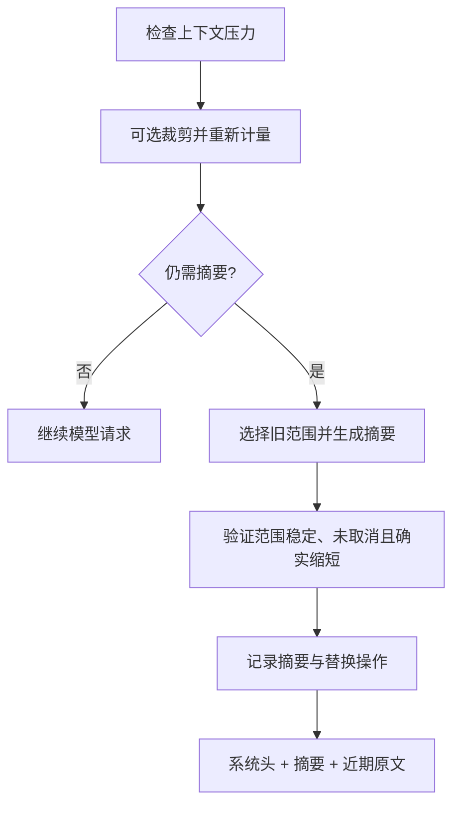

# 编码 Agent 如何压缩上下文：Claude Code、DSH 与 Pi 的源码设计

> 发布日期：2026-10-04 · 最近核对：2026-10-04

编码 Agent 连续读文件、搜索代码和运行测试时，工具输出会不断进入消息历史。上下文窗口有限，任务却可能持续数百个步骤。Agent 怎样腾出空间，同时记住用户的限制、已经做过的修改和下一步工作？

本文从源码拆解三种实现：Claude Code 2.1.88 的公开 source map 提取镜像、DeepSeek Harness（下文称 DSH）的压缩插件，以及 Pi coding-agent 的会话压缩，并整理可以迁移到自己 Harness 中的设计原则。

核心问题不只是“怎样把文字变短”，还包括：哪些内容可以移出当前请求，怎样保存恢复入口，何时调用摘要模型，以及怎样确认摘要不会覆盖刚发生的新工作。

本文是源码分析，没有运行三者的压缩质量或性能基准。所有案例、摘要文本和 token 演算均为示意，不表示真实调用记录或实测效果。

## 1. 分清完整历史、活跃上下文与磁盘状态

一次工具调用通常产生两部分：assistant 发出的调用，以及携带对应 ID 的工具结果。后续模型请求会把这些内容重新发送，因此一次大文件读取可能影响很多轮请求。

这里需要区分三种状态：

| 状态 | 保存什么 | 压缩后是否必然进入模型请求 |
| --- | --- | --- |
| 完整会话记录 | 原始用户消息、模型回复、工具调用及结果 | 否，取决于历史存储是否保留，以及当前视图如何构造 |
| 活跃上下文 | 本轮实际发送的消息、系统提示和工具声明 | 是，直接受上下文窗口约束 |
| 外部状态 | 当前代码、计划、工具输出文件、持久笔记 | 否，需要重新加载或通过工具读取 |

压缩通常作用于第二行，不是模型权重更新，也不是把文本编码成客户端可以随时解压的隐藏记忆。旧输出在磁盘上，只说明有恢复机会；模型仍需要知道路径、决定读取，并支付新的输入成本。


本文统一使用一个例子：用户要求修复“过期 session 仍允许访问”的问题，并明确禁止改变 API 返回结构。Agent 读取多个文件，修改 `auth.ts`，收到很长的测试日志，发现 `expiry_rejected` 仍失败。压缩后，它既要记得禁止修改返回结构，也要知道修改已经发生、测试尚未通过。

## 2. 固定版本，避免把条件分支当成通用行为

本次核对时，DSH 和 Pi 的上游主分支分别指向下表提交。文章使用固定提交链接，后续上游更新不会改变本文的引用内容。

| 对象 | 源码范围 | 本文采用的快照 |
| --- | --- | --- |
| Claude Code | 声明从 npm `@anthropic-ai/claude-code@2.1.88` 的 `cli.js.map` 提取的公开镜像 | [`c8cd253`][claude-repo] |
| DSH | `deepseek-ai/deepseek-harness`，`master` | [`5badb150`][dsh-repo] |
| Pi | `earendil-works/pi`，`main`，coding-agent 包元数据为 `1.0.2` | [`20038712`][pi-repo] |

Claude 镜像不是官方发布的完整源码仓库。本次检查了提取内容，未重新验证原始 npm 包与 source map 的完整哈希对应关系。镜像还缺少部分内部模块，涉及这些模块时，本文只描述可核对的调用位置和开关，不补写内部算法。[镜像来源说明][claude-readme]

## 3. Claude Code：多层清理与工作状态恢复

### 3.1 请求前不是单一摘要函数

`query.ts` 展示了多种处理入口：先取得最近压缩边界后的消息，再应用工具结果预算，随后经过可选 History Snip、microcompact、可选 Context Collapse 和 autocompact。

这是请求前的处理顺序，不表示所有步骤在所有环境都运行。部分逻辑依赖编译特性、远程配置、用户环境和模型支持。Context Collapse 启用时，还会抑制通常的主动 autocompact。

History Snip 会影响后续 token 判断：保留的 assistant usage 可能仍反映删减前的请求规模，因此代码还要扣除已释放的估算 token。仅凭“最近一次 API 报告了多少 token”，不能准确描述已经修改过的消息视图。

镜像中未找到 History Snip、Context Collapse 和部分缓存压缩模块的完整实现。它们确实有调用入口，但本文不推导其切分规则或折叠内容。[请求循环][claude-query]

### 3.2 自动压缩阈值包含两次预算扣除

`autoCompact.ts` 先按模型能力预留最多 20,000 个输出 token，再从有效窗口中扣除 13,000 个自动压缩缓冲 token。设窗口为 `W`，模型最大输出能力为 `M`：

```text
R = min(M, 20,000)
E = W - R
T = E - 13,000
```

例如 `W = 200,000` 且 `M >= 20,000`，可得到 `T = 167,000`。这里的 `R` 是该压缩判断使用的输出预留，不应直接当成用户配置的每轮输出上限。

auto-compact window 配置可以先降低 `W`；百分比覆盖也可以提前触发，但不能提高默认阈值。连续自动压缩失败达到三次时，会停止继续自动尝试。摘要自身超窗时的重试是另一套处理，不能把两者混为一个计数器。[阈值与自动压缩入口][claude-auto]

### 3.3 microcompact 可以不调用摘要模型

时间型 microcompact 清理较早的工具结果正文，保留调用结构和近期结果。源码默认配置为：关闭该功能、间隔 60 分钟、保留最近五个符合条件的结果；远程配置可以改变这些值。它主要针对满足条件的主会话，不是对所有子 Agent 都持续执行。

如果十次符合条件的工具调用已经产生结果，在功能启用且间隔条件满足时，较早五个结果可能被替换成清理标记，近期五个仍保留正文。这里没有生成旧结果的语义摘要。

还有缓存型路径：在内部特性、配置与模型条件满足时，通过 `cache_edits` 登记工具结果清理，并在指定位置重发相关编辑信息，本地消息数组可以不发生同样的正文替换。由于对应完整模块缺失，无法确认全部触发细节。

因此，不能把这版源码概括为“每轮无条件清掉旧工具输出”。不支持这些路径的会话，仍可能直接依赖完整 autocompact 处理压力。[微压缩实现][claude-micro]、[时间型配置][claude-time]

### 3.4 完整 compact 生成可继续工作的交接摘要

完整压缩先执行 PreCompact hook，合入自定义压缩要求，再请求摘要。提示覆盖用户意图、技术概念、文件与代码、错误修复、问题处理、用户消息、未完成任务、当前工作和下一步。

示意摘要可以写成：

```text
目标：拒绝过期 session，保持 API 返回结构。
用户纠正：已明确否定修改返回结构的方案。
已完成：修改 auth.ts 的鉴权路径。
未解决：expiry_rejected 仍失败，涉及过期边界比较。
下一步：检查比较条件，修复后重跑相关测试。
```

摘要必须保留用户否定过的方案，否则 Agent 很容易在压缩后重新提出它。文件名也不够：还需要说明修改已经发生、验证没有完成，避免重复编辑或把失败误写成成功。[摘要提示][claude-prompt]

默认优先尝试共享父会话提示缓存的 fork：继承父会话的系统提示、工具、主循环模型等配置，限制一个回合，并禁止真正执行工具。另有独立摘要请求的回退路径。因此，“Claude Code 必定用 Haiku 压缩”不是这份源码支持的结论。

普通完整 compact 的后续上下文主要由压缩边界、摘要、恢复附件及 hook 结果构成，不能假设它必然保留一段最近的原始聊天。部分压缩变体可以保留原始消息，下面的 Session Memory 就是一个例子。[完整压缩实现][claude-compact]、[fork 调用机制][claude-fork]

### 3.5 摘要之外，还要恢复文件、计划与规则

压缩后会清理部分读取缓存，再恢复相关外部状态。文件恢复逻辑按最近访问记录选择，最多五个文件，单文件预算为 5,000 token；计划、调用过的 Skill、后台 Agent 状态和部分工具信息也有相应恢复路径。SessionStart 的 compact hook 输出可以进入新上下文。

这些内容职责不同：摘要保留“为什么、做到哪里”，文件提供“现在的具体代码”，计划与规则提供“接下来如何行动”。完整 transcript 的路径还提供历史细节回查入口。

重新读取代码有一个边界：它获取的是磁盘当前状态，不一定是此前读取时的版本。若需要解释历史错误，应回查历史输出或版本记录，不能仅凭当前文件还原整个过程。[附件恢复逻辑][claude-compact]

### 3.6 Session Memory 把部分总结工作提前到后台

这份源码还有当前会话的后台笔记机制。它与跨会话自动记忆不是同一件事：后台 fork 更新会话笔记，并记录最后已经总结到的消息 ID。

默认参数包括约 10K token 的初次提取门槛、至少 5K 的后续增长，以及工具调用数量或自然回复边界检查；相关开关默认关闭，可由配置改变。所以不能简化为“每三个工具调用一定总结一次”。[后台提取][claude-memory]

如果笔记已经覆盖 `M1～M80`，之后新增 `M81～M100`，自动压缩可以优先组合：

```text
后台笔记形成的摘要
＋ 尚未总结的原始消息
＋ 必要的恢复内容
```

尾部太小时会向前扩展，默认至少约 10K 估算 token 和五条带文本的消息，并调整工具配对与消息边界。约 40K 是停止扩展时考虑的预算，不是所有情况下的硬上限。

笔记为空、检查点无法匹配或压缩后仍过大时，回退到完整 compact。这个机制减少的是压缩临界点重新总结整段历史的等待；后台摘要调用已经产生的成本仍然存在。[笔记压缩与尾部选择][claude-memory-compact]

## 4. DSH：以事件日志提交上下文替换

### 4.1 计量、裁剪和摘要由不同组件承担

DSH 的压缩由 token meter、compaction-basic、可选工具结果 pruner 等组件组成。正常检查发生在 `agent/pre-step`，即请求模型之前；确认上下文溢出错误后，也有恢复入口。

token meter 衡量的是请求表面，包括消息与请求包络开销。匹配当前请求条件时可以复用 provider usage，否则使用估算。模型路由、工具声明或消息视图变化后，不能无条件沿用旧请求的计量。[token meter][dsh-meter]

默认阈值与近期保留预算分别为：

```text
T = floor(min(0.8 × W, W - O - 65,536))
K = floor(0.16 × (W - O))
```

`O` 是有效请求输出预留，65,536 是默认 headroom。窗口较小时需要降低 headroom 等配置，否则预算可能不可用。配置还支持指定 provider/model 的精确覆盖。

若 `W = 200,000`、`O = 20,000`，则 `T = 114,464`，`K = 28,800`。提前触发的原因包含预算策略，不能仅据触发比例评价压缩质量。[预算配置][dsh-config]

### 4.2 可选 pruner 先裁剪超长工具输出

压力或溢出条件满足时，如果装载 pruner，它可以处理超过 8,192 个 Unicode 码点的工具文本：保留开头 4,096、末尾 1,024，中间插入省略标记，不请求 LLM。完整内容仍存在原始事件日志中。[裁剪器说明][dsh-pruner]

例如测试日志中间都是重复输出，失败栈在最后。保留头尾有助于同时留下启动环境和失败位置。若裁剪后上下文已低于阈值，整个摘要调用可以跳过。

示意：原计量 120K，裁剪后 110K，而阈值为 114,464，就不必进一步调用摘要模型。这里的计量变化仅用于说明控制流程，不是实测。

### 4.3 选旧前缀做摘要，近期尾部继续保持原文

仍有压力时，DSH 从后向前累积近期保留预算，再选择更早的范围压缩。系统头被单独处理，切点需要保证工具调用与结果结构闭合。特别长的用户回合可以在闭合的工具步骤间切开，不要求整个用户回合全部留下。

确认溢出时会采用更激进的保留预算，但仍留下最新不可拆的结构单位，不能解释成“把所有近期消息都删掉”。[范围选择][dsh-region]

摘要请求重放原系统提示、工具声明和选中的旧前缀，在末尾加入摘要指令。它尝试利用已有前缀缓存；实际收益仍依赖 provider、模型、请求表示和缓存有效性。保留尾部不需要在这次摘要里重复总结。

摘要保留用户目标、技术概念、文件代码、错误修复、待办、当前工作、下一步和关键上下文。遇到旧 checkpoint 时，应保留仍成立的事实、删除过时事实、合并新信息，避免不断堆积旧摘要。[摘要请求][dsh-summary]

### 4.4 生成摘要与提交摘要是两个阶段

DSH 保留完整事件日志，通过摘要消息携带的范围替换操作，改变后续模型可见视图。



如果摘要生成期间上下文发生变化，提交前必须检查所选范围或会话表面是否仍有效。还要确认带完整 framing 的摘要实际更短，并处理取消和重叠操作。

日志保留使回查成为可能，提交验证则避免把过时摘要当成当前状态。这两个目标不能相互替代。

失败边界同样重要：摘要尚未提交时，原可见视图继续有效；如果此前裁剪已经提交，后面的摘要失败不会自动撤销裁剪。溢出恢复也要求有有效的上下文替换后才授权重试，否则请求可能一直撞同一个窗口上限。[压缩生命周期与提交][dsh-basic]

## 5. Pi CLI：摘要节点、原文尾部与会话树

### 5.1 默认阈值与检查时机

Pi coding-agent 默认 `reserveTokens = 16,384`，`keepRecentTokens = 20,000`。当上下文 token 超过 `W - reserveTokens` 时进入自动压缩判断。200K 窗口对应 183,616 的阈值。[默认值与压缩判断][pi-compact]

检查不仅发生在新用户请求前，还发生在工具结果追加后、下一次 assistant 请求之前。最新有效 usage 结合新增消息估算参与计量；缓存读取的 token 仍占窗口。视图编辑会影响 usage 锚点，代码需要处理这种失效，避免已经省略内容后仍拿旧的大 usage 反复触发压缩。[会话循环][pi-agent]

### 5.2 保留近期原文，必要时拆分长回合

Pi 从后向前累计近期预算，并寻找合法切点。它不会从一个孤立工具结果开始保留，通常尽量照顾用户回合边界；回合过长时可以在合适的 assistant 边界拆开。

被拆回合的前半与更早历史可以分别总结，再合成摘要。因此一次压缩可能包含一次或两次摘要调用，取决于有没有早期历史及是否拆回合。不能统一按一次 API 调用计算成本。[切点与摘要组合][pi-compact]

### 5.3 摘要输入先序列化，工具结果只保留开头

Pi 将用户、assistant、思考、工具调用与工具结果序列化成摘要输入，再用独立的摘要系统提示请求模型。它不是刻意重放主聊天的暖前缀，相关调用设置 `cacheRetention: none`。[摘要请求][pi-compact]

这里一个重要取舍是：供摘要模型读取的工具结果最多保留开头 2,000 字符，并附截断说明。这个限制作用于摘要输入，不代表正常主循环的全部工具结果都统一截断。[序列化工具][pi-utils]

回到测试日志：如果失败栈只在末尾，且 assistant 没有先复述失败信息，摘要调用可能看不到关键错误。DSH 可选 pruner 的头尾保留，在这种日志分布下更有利；这只是输入处理的差别，不足以推导整体摘要质量排名。

常规历史摘要输出上限为 `min(floor(0.8 × reserveTokens), 模型最大输出)`，默认约 13,107 token；拆分回合前缀的摘要还有自己的上限。上限不是实际摘要长度。

摘要维护目标、约束、进度、关键决策、下一步和关键上下文，后续压缩会结合旧摘要更新，而非不断累积全部旧摘要。文件操作也会被代码提取为已读、已修改文件列表，降低完全依赖模型回忆文件名的风险。[摘要生成与文件记录][pi-compact]

### 5.4 CompactionEntry 是重建边界，不是历史删除

压缩结果作为 `CompactionEntry` 追加到会话记录，其中包含摘要、`firstKeptEntryId`、压缩前计量等信息。后续通过投影重建活跃上下文：

```text
系统提示
＋ 最新压缩摘要
＋ firstKeptEntryId 起的保留原文
＋ 后续新增消息
```

旧记录仍可在会话历史和树中访问。重复压缩会更新摘要边界；切换树分支时的 Branch Summary 则是另一种用途，不能与窗口压力压缩混为一谈。[会话存储与重建][pi-session]

Pi 的上下文溢出恢复会省略失败尝试的相关可见消息，尝试压缩并重跑一次。扩展可以通过 `session_before_compact` 取消默认压缩或提供自定义结果；业务状态能否额外保留，取决于扩展，不是默认实现的保证。[恢复与扩展入口][pi-agent]

### 5.5 Pi Durable 的后台压缩需要单独看

同一仓库中的实验性 Pi Durable 支持提前后台生成摘要，Agent 可以继续工作，摘要在合适的边界放入上下文。它不是 Pi CLI 默认压缩流程的同义描述。

示例默认配置为：预留 16,384、保留近期 20,000、提前量 32,768。200K 窗口下，可理解为约 150,848 开始后台准备，约 183,616 之后的下一请求需要等待压缩。

并发摘要提交要检查覆盖边界：旧任务不能把已经推进的压缩起点倒退。生成摘要的成本被提前支付，而不是消失。与 Claude Session Memory 相比，前者准备可提交的摘要任务，后者维护后台会话笔记并组合未总结尾部。[Durable 文档][pi-durable]

## 6. 放在同一预算下比较，不能把阈值当成胜负

下表统一假设窗口为 200K。Claude 另假设模型最大输出至少 20K；DSH 另假设有效输出预留为 20K。三者计量方法和预留含义不同，因此表格只说明配置算式。

| 实现 | 示例触发阈值 | 近期原文策略 | 续接依赖 |
| --- | --- | --- | --- |
| Claude Code 2.1.88 普通 autocompact | 167,000 | 普通完整压缩不保证保留固定原文尾部 | 摘要、附件、规则与状态恢复 |
| Claude Session Memory 路径 | 沿用自动压力判断 | 未总结尾部，必要时向前扩展 | 后台笔记、检查点与原文尾部 |
| DSH 默认 basic | 114,464 | 本例预算约 28,800，按结构调整 | checkpoint、近期消息、事件日志 |
| Pi CLI 默认 | 严格超过 183,616 | 约 20,000，按合法切点调整 | 更新后的摘要、会话投影和原文尾部 |

更早压缩会增加整理机会，也可能增加调用成本；更晚压缩保留更多原文，却让异常大工具结果更容易挤满窗口。要评价实际收益，需要固定模型、任务、工具输出分布和配置，测量成本、等待时间、任务成功率及关键信息保留情况。

缓存也要分清阶段。Claude 的 fork 和 DSH 的前缀重放主要尝试降低摘要生成阶段的成本；替换历史后，下一次主请求的前缀已经变化。不能从“摘要调用命中缓存”推导“压缩后的主请求缓存全部不变”。

## 7. 自己实现时，优先保证哪些边界

这些实现提供的共同启发，是把压缩作为上下文管理的一条完整执行路径，而不是额外加一个总结 prompt。

1. **分开保存完整记录与活跃视图。** 省略内容时给出可信恢复入口，并说明是否已在工具层截断。
2. **保护消息结构和当前请求。** 工具结果要能找到对应调用；人类请求不能与同为 user 角色的工具结果混淆。
3. **优先处理可恢复的大输出。** 不调用模型的转存和裁剪通常成本低，但裁剪方式应适配日志分布。
4. **摘要保存任务状态。** 用户纠正、否定方案、已发生副作用、未通过验证和下一步，比泛泛的技术主题更能支持续接。
5. **将生成和提交分开。** 后台或并发场景下，提交前验证范围、版本、取消状态及是否真正缩短。
6. **控制失败重试。** 只在上下文确实改变后重试，记录裁剪已经提交而摘要失败等中间状态。

以本文的 session 修复案例做验证，可以在压缩前放入“不能改变返回结构”的纠正、已经执行的文件修改、尾部错误栈和未完成测试，再检查续接 Agent 是否保留约束、避免重复副作用、准确定位失败并继续验证。对恢复路径，还应主动读取归档，确认需要的旧内容真的可获得。

本文没有完成这类跨实现实测，因此只据源码讨论机制与边界。Claude Code 的状态恢复、DSH 的事件替换提交、Pi 的摘要节点重建，分别解决续接过程的不同问题；把这些问题拆开，比仅比较一个压缩比例更有助于设计自己的 Harness。

## 源码入口

| 实现 | 建议阅读顺序 |
| --- | --- |
| Claude Code | [query][claude-query] → [autoCompact][claude-auto] → [microCompact][claude-micro] → [compact][claude-compact] → [Session Memory 压缩][claude-memory-compact] |
| DSH | [配置][dsh-config] → [范围选择][dsh-region] → [摘要请求][dsh-summary] → [生命周期与提交][dsh-basic] |
| Pi | [compaction][pi-compact] → [序列化][pi-utils] → [会话重建][pi-session] → [agent-session][pi-agent] |

[claude-repo]: https://github.com/Exhen/claude-code-2.1.88/tree/c8cd253554319f32ff64ff7000636199f720c9bc
[claude-readme]: https://github.com/Exhen/claude-code-2.1.88/blob/c8cd253554319f32ff64ff7000636199f720c9bc/README.md
[claude-query]: https://github.com/Exhen/claude-code-2.1.88/blob/c8cd253554319f32ff64ff7000636199f720c9bc/source/src/query.ts
[claude-auto]: https://github.com/Exhen/claude-code-2.1.88/blob/c8cd253554319f32ff64ff7000636199f720c9bc/source/src/services/compact/autoCompact.ts
[claude-micro]: https://github.com/Exhen/claude-code-2.1.88/blob/c8cd253554319f32ff64ff7000636199f720c9bc/source/src/services/compact/microCompact.ts
[claude-time]: https://github.com/Exhen/claude-code-2.1.88/blob/c8cd253554319f32ff64ff7000636199f720c9bc/source/src/services/compact/timeBasedMCConfig.ts
[claude-compact]: https://github.com/Exhen/claude-code-2.1.88/blob/c8cd253554319f32ff64ff7000636199f720c9bc/source/src/services/compact/compact.ts
[claude-prompt]: https://github.com/Exhen/claude-code-2.1.88/blob/c8cd253554319f32ff64ff7000636199f720c9bc/source/src/services/compact/prompt.ts
[claude-fork]: https://github.com/Exhen/claude-code-2.1.88/blob/c8cd253554319f32ff64ff7000636199f720c9bc/source/src/utils/forkedAgent.ts
[claude-memory]: https://github.com/Exhen/claude-code-2.1.88/blob/c8cd253554319f32ff64ff7000636199f720c9bc/source/src/services/SessionMemory/sessionMemory.ts
[claude-memory-compact]: https://github.com/Exhen/claude-code-2.1.88/blob/c8cd253554319f32ff64ff7000636199f720c9bc/source/src/services/compact/sessionMemoryCompact.ts
[dsh-repo]: https://github.com/deepseek-ai/deepseek-harness/tree/5badb15009ae1756c3afe0ae0cef1faafc290ccc
[dsh-config]: https://github.com/deepseek-ai/deepseek-harness/blob/5badb15009ae1756c3afe0ae0cef1faafc290ccc/packages/compaction/compaction-basic/src/config.ts
[dsh-region]: https://github.com/deepseek-ai/deepseek-harness/blob/5badb15009ae1756c3afe0ae0cef1faafc290ccc/packages/compaction/compaction-basic/src/region.ts
[dsh-summary]: https://github.com/deepseek-ai/deepseek-harness/blob/5badb15009ae1756c3afe0ae0cef1faafc290ccc/packages/compaction/compaction-basic/src/summarizer.ts
[dsh-basic]: https://github.com/deepseek-ai/deepseek-harness/blob/5badb15009ae1756c3afe0ae0cef1faafc290ccc/packages/compaction/compaction-basic/src/index.ts
[dsh-meter]: https://github.com/deepseek-ai/deepseek-harness/blob/5badb15009ae1756c3afe0ae0cef1faafc290ccc/packages/llm/token-meter/README.md
[dsh-pruner]: https://github.com/deepseek-ai/deepseek-harness/blob/5badb15009ae1756c3afe0ae0cef1faafc290ccc/packages/compaction/compaction-tool-result-pruner/README.md
[pi-repo]: https://github.com/earendil-works/pi/tree/200387122ca450d6387f033949423114a270b96c
[pi-compact]: https://github.com/earendil-works/pi/blob/200387122ca450d6387f033949423114a270b96c/packages/coding-agent/src/core/compaction/compaction.ts
[pi-utils]: https://github.com/earendil-works/pi/blob/200387122ca450d6387f033949423114a270b96c/packages/coding-agent/src/core/compaction/utils.ts
[pi-agent]: https://github.com/earendil-works/pi/blob/200387122ca450d6387f033949423114a270b96c/packages/coding-agent/src/core/agent-session.ts
[pi-session]: https://github.com/earendil-works/pi/blob/200387122ca450d6387f033949423114a270b96c/packages/coding-agent/src/core/session-manager.ts
[pi-durable]: https://github.com/earendil-works/pi/blob/200387122ca450d6387f033949423114a270b96c/packages/durable/README.md
