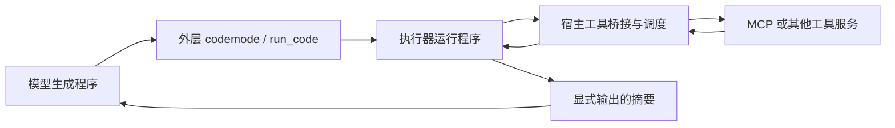

# Pi Codemode 与 DeepSeek Harness PTC：工具编排为什么要交给程序

当一个智能体需要读取多个接口、根据返回值继续查询，再把结果筛选成一份摘要时，模型究竟应该逐步指挥每次调用，还是先写一段程序，让程序完成这些步骤？

Pi Codemode 和 DeepSeek Harness PTC 都选择了后一种方式。模型负责生成编排程序，运行时负责执行程序和实际工具调用；中间结果可以留在程序变量里，最后再把需要的信息交给模型。它们有相似的数据流，但接口说明的提供方式、返回值契约和执行器不同。理解这些差异，比先给两者排一个速度名次更有用。

本文先解释这两种实现，再用同一 MCP 服务上的四条执行路径和不同规模的数据说明开销来自哪里。订单只是验证机制的例子，前半部分不依赖订单业务。

## 模型请求、程序调用和 MCP 是三件事

普通 Tool Calling 中，宿主把工具声明放进模型请求。模型响应一个工具名称和参数，宿主执行，再把工具结果加入消息历史，让模型决定下一步。一次响应也可以包含多个独立工具调用，宿主可以并行执行；因此“并行”本身并不是代码编排的专属能力。

代码编排把一次模型选择的粒度变大了。模型仍然通过外层工具入口提交代码，但程序内部可以自己循环、分支、等待接口、并发请求和汇总。内部一次 `tools.xxx()` 调用不等于一次新的 LLM 请求。

MCP 则是底层工具服务的协议。在两种路径中，程序都可以通过宿主绑定访问同一个 MCP 服务。代码并没有代替 MCP，也不要求 MCP 服务自己能运行 JavaScript。



关键边界在于：**哪些数据要跨回模型上下文。** 程序读取了完整结果，不代表模型也必须读取完整结果。代码里保留的变量和外层工具最终输出，是不同的数据通道。

## Pi Codemode：接口可以按需发现，编排在 QuickJS 中执行

### 接口是怎样进入模型的

Pi 用工具注册表管理真实能力。启用 Codemode 后，宿主提供 `codemode` 入口，并把可调用工具映射为脚本里的 `tools.<name>()`。工具实际仍然注册在宿主中，模型看不到某个 JSON 声明，不等于这个能力不存在。

需要区分两个设置：`codemode.mode` 控制其他工具是否继续作为模型的直接入口；MCP 的 `exposure` 控制 MCP 工具如何呈现。我们的配置是 `mode: only` 加 MCP `exposure: codemode`。这使模型通过脚本调用业务能力，而业务 MCP 工具按 deferred 方式暴露，不把全量声明预载到模型上下文。

Codemode 并不把所有工具都一律隐藏。非 deferred 工具还可以按 inline budget 出现在入口描述中。因此本文讨论的“按需发现”，特指本 Demo 的 MCP 暴露配置，不能推广成任何 Codemode 配置的固定行为。

Pi 提供 `searchTools()`、`describeTool()` 和 `describeNamespace()`。宿主拥有完整的可调用工具目录；搜索和描述发生在运行时，只有脚本输出的那部分说明才会回到模型。本版本搜索使用 BM25，模型不需要先下载全部 schema 再自己筛。

下面是与业务无关的发现写法，其中查询词由当前任务决定：

```javascript
const hits = await searchTools("当前任务需要的能力", { limit: 3 });
for (const hit of hits) {
  text(await describeTool(hit.name));
}
```

搜索返回名称和简介，描述返回接口声明。模型看到参数和返回字段以后，可以在后续响应中生成实际编排程序。已知接口或已在上下文里有说明时，不一定还要重新发现；“发现一轮、业务一轮”是我们为观察机制采用的提示策略，并非框架强制的最低轮数。

### 程序怎样调用真实工具

`codemode` 的源码在 QuickJS-WASM 中执行。宿主为沙箱安装工具绑定和发现函数；内部调用经由 `ctx.executeTool()` 回到 Agent 的工具执行管线，因此仍有真实的工具事件、错误处理和父调用关联。它不是模型假装调用接口，也不是在 JavaScript 中直接拼一个未经管理的 HTTP 请求。

可以把执行过程理解成：

```text
模型提交源码
  → QuickJS 执行 async 程序
  → tools.<name>(参数) 触发宿主执行工具
  → 结果交还脚本，继续计算
  → text()/return 的输出成为外层工具结果
  → 模型读取摘要，继续回答
```

QuickJS 没有 Node API、直接文件系统、直接网络或计时器。外部能力由宿主绑定提供；绑定里允许什么仍由宿主工具和权限决定。不能从“沙箱里没有网络”推断它无法通过一个获准的工具访问远端服务。

每个工具调用和发现调用都返回 Promise，使用它们的结果前必须 `await`。脚本结束时仍在执行的调用会被取消，未等待的 Promise 会被丢弃。脚本出错也不会回滚此前已经完成的外部操作。这是正确性和副作用管理的要求，不只是代码风格。

### 原始结果为何可以不进入模型

以“读取列表，核对各条目，然后返回统计”为例，示意程序可以是：

```javascript
// 以下函数名称只是示意；实际名称及字段应从接口声明取得。
function unpack(result) {
  if (result.isError) throw new Error(JSON.stringify(result.content));
  return result.structuredContent ??
    JSON.parse(result.content.find(b => b.type === "text").text);
}
const list = unpack(await tools.mcp__service__list({}));
const selected = list.items.filter(item => item.needsCheck);
const checked = await Promise.all(selected.map(async item =>
  unpack(await tools.mcp__service__inspect({ id: item.id }))
));
text({ checkedCount: checked.length });
```

Pi 的 MCP 绑定返回 `CallToolResult` wrapper，业务字段位于 `structuredContent` 或文本内容里，需要检查错误并解包。循环中拿到的完整结果留在 QuickJS 变量中；这里模型只收到计数以及执行器的状态信息。若脚本改成 `text(list)`，模型就会收到原始列表，节省上下文的收益随之消失。

`text()`、顶层 `return` 和 `console.log()` 都可能进入输出。输出边界需要程序主动控制，框架不会自动理解哪些字段对业务无关。小型跨调用状态可以用 `store()/load()`；每次成功脚本的写入会保存到会话分支，不能把它当成存放无限原始数据的仓库。

这些机制对应 Pi 1.0.0 的 `extensions/codemode/tool.js` 和 `execute.js`。可结合 [Pi Codemode 文档](https://pi.dev/docs/latest/codemode)及 [MCP 配置文档](https://pi.dev/docs/latest/mcp)阅读；官方 latest 页面可能继续变化，本仓库以锁定版本为准。

## Harness PTC：生成 SDK，程序通过宿主调度工具

PTC 是 Programmatic Tool Calling，即程序化工具调用。这里具体比较 DeepSeek Harness 的 `ToolRuntime`、SDK 生成器和官方 `NodePtcRuntime`，而不是泛指所有以代码调用工具的方案。

### SDK 声明和模型工具入口是两种表示

Harness 的工具注册表保存名称、描述、输入 schema、输出 schema、执行函数及相关运行策略。在 `mode: ptc` 下，宿主给模型一个外层 `run_code` 工具，并把可见业务工具转换为 `tools:sdk` 提示段。对于本次 Node 执行器，这段文本是描述 `tools.<name>()` 的 TypeScript 声明及使用说明。

SDK 是帮助模型写程序的接口契约，**不是一批新的模型直接调用入口，也不是把服务实现源码打包给模型。** 实际工具仍由宿主执行。即使请求的 JSON tools 数组只有 `run_code`，系统提示里的完整 SDK 也会消耗输入 token。

本 Demo 没有额外过滤注册的业务工具，所以 3、18 或 60 个注册工具都进入 SDK。增加无关工具会增加首轮 SDK 文本。这里的“全量”指当前可见的注册工具集合，不是 Harness 在任何配置下都必须加载世界上所有工具。

### `run_code` 中的一次调用如何走到服务

模型传入 `code` 和 `description`。`code` 是 async 函数体，可以顶层 `await` 和 `return`。官方 Node 执行器处理可擦除的 TypeScript 语法、启动新的 Node 子进程，并建立宿主与执行进程之间的控制通道。

进程内的 `tools.<name>()` 是工具绑定。它把名称和 JSON 参数送回宿主；宿主查找注册工具、经过调度执行，然后把 canonical JSON 返回给进程，等待中的 Promise 才得到结果。流程是：

```text
模型调用 run_code({code, description})
  → 官方 Node 执行器启动子进程
  → 程序调用 tools.<name>(参数)
  → 控制通道转交宿主工具注册表与调度器
  → 工具执行，canonical JSON 返回程序
  → return 的值及输出形成外层工具结果
  → 模型继续生成最终答案
```

内部子调用会记录为 `tool/ptc-dispatch` 等会话事件，便于恢复调用经过；它们不都以独立的原始工具结果进入下一次模型请求。可观测的宿主日志和模型读取的上下文，依然是两个边界。

如果沿用前面的通用示例，PTC 程序是：

```javascript
// 同样只是示意；实际接口以生成的 SDK 为准。
const list = await tools.mcp__service__list({});
const selected = list.items.filter(item => item.needsCheck);
const checked = await Promise.all(selected.map(item =>
  tools.mcp__service__inspect({ id: item.id })
));
return { checkedCount: checked.length };
```

这里可以直接访问业务字段，是因为我们的 MCP bridge 已先检查并解包 MCP wrapper，再把值交给 Harness 的 canonical JSON 输出契约。**这不是 MCP 协议天然返回了不同数据。** 两边访问同一服务，适配层不同；Pi 的程序自己解包，PTC 的 bridge 解包。为兼容 Harness schema 子集，bridge 也把 `type: ["string", "null"]` 等价转换为 `oneOf`。

### 并发和沙箱分别由谁负责

`Promise.all()` 表达的是程序希望同时等待多个调用。真正同时运行多少个，还取决于宿主调度器。在本次 PTC 配置里，`maxParallelSubCalls` 为 8，超出的调用会排队，并不是写了 52 个 Promise 就有 52 路实际并发。

Node 子进程本身也不等于完整的安全沙箱。文件、进程和其他能力由所组合的运行后端及权限策略决定。我们的 Windows 后端使用 `read-only` 策略，记录的 enforcement 为 `partial`；本文不把它表述为完整隔离，也不把它与没有 Node API 的 QuickJS 混为一谈。

具体实现见 [ptc.mjs](../demo/ptc.mjs)：官方 Cordis 服务组合负责 LLM 适配、工具注册、SDK、AgentLoop、会话投影和 Node PTC；独立 stdio MCP 进程负责业务接口。我们没有启动完整 Harness 产品，没有加载它的个人配置、产品默认身份或其他工具。实际比较的是官方核心执行路径，不能把测到的启动耗时当作完整桌面应用的性能。

可对照 [Harness 工具运行时](https://github.com/deepseek-ai/deepseek-harness/blob/dsh-v0.2.0-rc.2/packages/core/tools/README.md)和 [Node PTC 执行器](https://github.com/deepseek-ai/deepseek-harness/blob/dsh-v0.2.0-rc.2/packages/ptc-runtime/ptc-runtime-node/README.md)。本仓库使用 `0.2.0-rc.2`；2026-10-02 已核对，它是当时 `@deepseek-ai/dsh` 的 npm latest 和最近的 GitHub 发布版本，而非 master 最新源码。

## 两种实现的取舍在哪里

| 维度 | 本文 Pi Codemode 配置 | 本文 Harness PTC 配置 |
| --- | --- | --- |
| 模型外层入口 | `codemode` | `run_code` |
| 业务接口说明 | deferred MCP 接口按需搜索、描述 | 可见注册工具的 SDK 预先进入系统提示 |
| 执行器 | QuickJS-WASM | 官方 Node 子进程 |
| 本次 MCP 返回契约 | `CallToolResult`，脚本解包 | bridge 解包后的 canonical JSON |
| 原始结果所在位置 | 脚本变量和宿主记录 | 程序变量和宿主记录 |
| 模型收到什么 | 发现输出、显式业务输出及运行信息 | 程序返回值、输出及运行信息 |
| 实际子调用并发 | 由 Pi 工具执行管线决定 | 由 Harness 调度器及子调用上限决定 |

两者共同节省的是模型不需要读取的中间数据。相比并行 Tool Calling，它们还能把“读列表后再决定查谁”这样的依赖链放在同一段程序中，减少模型参与中间决策的次数。

两者不同的开销，一部分来自接口准备。预载 SDK 使模型可以立即写代码；按需发现使上下文只携带当前所需的接口，但搜索和描述也有成本，可能增加一次模型往返。工具少、返回值短时，这笔发现成本可能不划算；工具多而每次只用少数接口时，按需说明更有机会减少输入。

另一部分来自生成代码和执行环境。代码越长，输出 token 越多；进程启动、工具排队、错误后的修复程序也会影响延迟。少一轮模型请求并不保证整条路径更快。是否便宜还要同时看输入、缓存命中及输出：

```text
费用 =（未命中输入 × 未命中单价
      + 命中输入 × 命中单价
      + 输出 × 输出单价）/ 1,000,000
```

因此“PTC 更快、Codemode 更省”只能是某个配置的观察，不适合当成它们的定义。下面的数据用来验证开销怎样变化，而不是为两个框架给出永久排名。
